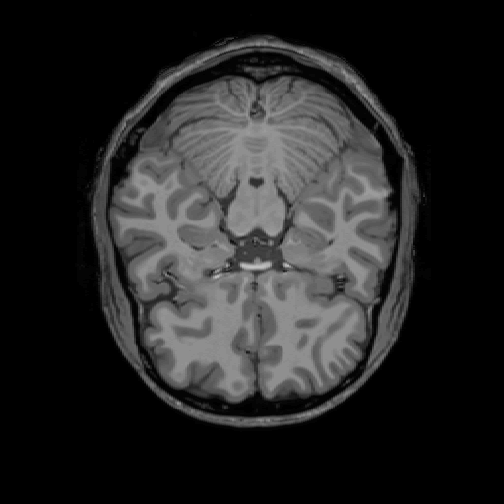
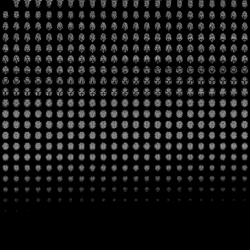
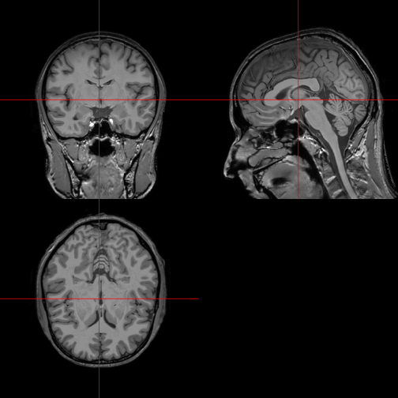
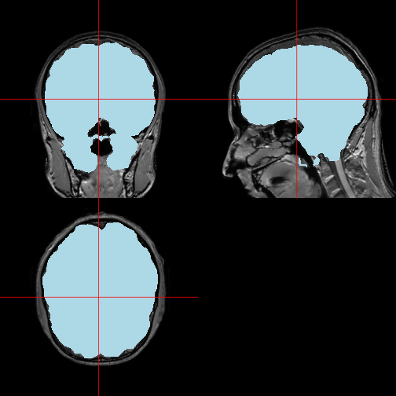
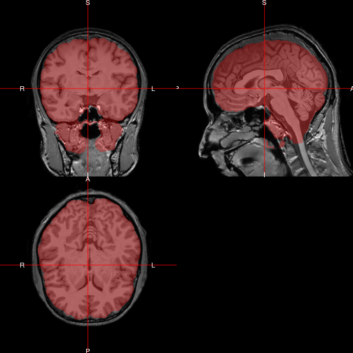
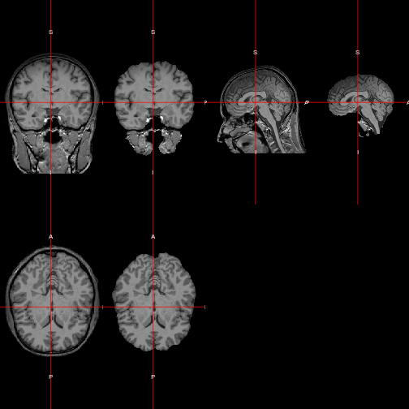
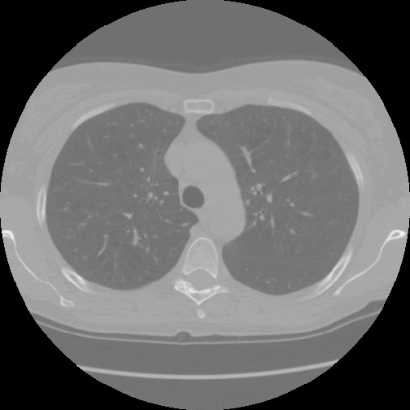
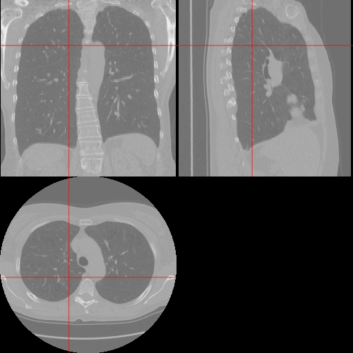

Lately I was getting a little bored with genomic data (and then TCGA2STAT started to give me a segfault on my university's high performance computing facility too :stuck_out_tongue:). So I decided to analyze some brain imaging data that I had lying around instead. The first step is to do some visual data exploration. In this blog post I present some functions which I was able to find for MRI visualization in R, and which I found to be very useful. All functions presented below presuppose an image in the [NIfTI data format](https://nifti.nimh.nih.gov/nifti-1/) as input, and are very user-friendly.

### Example MRI data

A T1 image obtained from <http://www.jannin.org/mritemplate/> ([this one](http://www.jannin.org/mritemplate/data/Template-T1-U8-RALPFH-BR.nii.gz) to be precise) is used for example purposes in what follows. We can read it into R using the library `oro.nifti`.


```r
library(oro.nifti)
img <- readNIfTI("Template-T1-U8-RALPFH-BR.nii.gz", reorient = FALSE)
class(img)
## [1] "nifti"
## attr(,"package")
## [1] "oro.nifti"
dim(img)
## [1] 182 512 512
```

### Visualize brain slices with *image*

The library `oro.nifti` provides a version of the generic function `image`. It allows to plot slices of the brain. The following plots the 225th axial slice of `img`.

```r
image(img, z = 225, plot.type = "single")
```



It can also be used to draw all available slices in a single plot next to each other (but that turns out not very helpful in this case).

```r
image(img)
```



### Display an orthographic projection with *orthographic*

The function `orthographic`, also from the library `oro.nifti`, gives an excellent overview of the 3D structure of the brain in two dimensions.


```r
orthographic(img)
```



In order to indicate or emphasize a certain region of the brain, `orthographic` can be used to display a mask on top of the original image. For example, the following code chunk removes the skull from the MRI data (you need the [FSL](https://fsl.fmrib.ox.ac.uk/fsl/fslwiki/) software and the [fslr](https://github.com/muschellij2/fslr) R package for this), and then plots the extracted brain as a mask on top of the original image.

```r
# skull stripping using FSL's Brain Extraction Tool (BET)
library(fslr)
img_bet <- fslbet(infile = img, retimg = TRUE)

# plotting extracted brain as a mask on top of original data
mask <- img
in_mask <- img_bet > 0
mask[in_mask] <- 1
mask[!in_mask] <- NA
orthographic(x = img, y = mask, col.y = "lightblue")
```



(Notice that the extracted brain does not fit the original image quite perfectly, but I will not pursue further improvements to the skull stripping at this point, in order to concentrate on visualization alone.)

### Polish orthographic displays with *ortho2*

The R package `neurobase` provides the function `ortho2` as an improved version of `orthographic`. Here we use it to overlay the brain as a semi-transparent layer on top of the original image.

```r
library(scales)
ortho2(img, mask, col.y = alpha("red", 0.3))
```



### Show two orthographic displays side by side with *double_ortho*

The function `double_ortho` can be used to display two orthographic brain images of the same dimensions next to each other. As a quick demonstration we can look at the original image and the extracted brain side by side.

```r
brain <- img
brain[!in_mask] <- NA
double_ortho(img, brain)
```



### Beyond MRI

Of course the same functions can be repurposed for other types of imaging data. For example I can look at CT images of the lung, where the data is taken from [a current kaggle.com competition](https://www.kaggle.com/c/data-science-bowl-2017).

```r
library(oro.dicom)
# generate a NIfTI image from a collection of DICOMs
all_slices <- readDICOM("./00cba091fa4ad62cc3200a657aeb957e/")
nii <- dicom2nifti(all_slices)
```

An `oro.nifti::image` plot of the lung:

```r
image(nii, z = 100, plot.type = "single")
```



An `oro.nifti::orthographic` plot of the lung:

```r
orthographic(nii, xyz = c(200, 220, 100))
```


