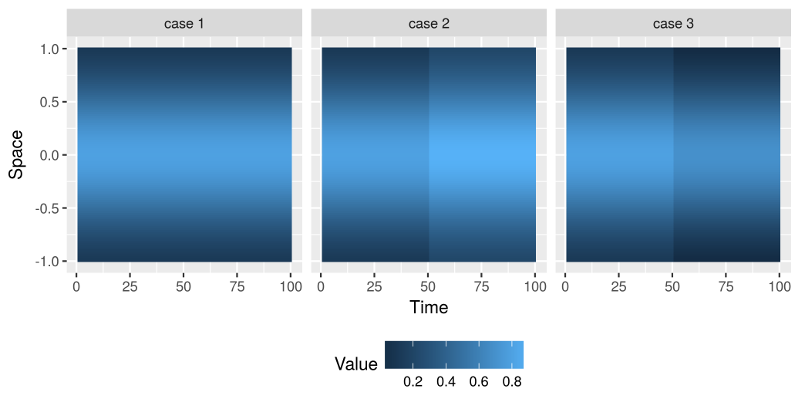
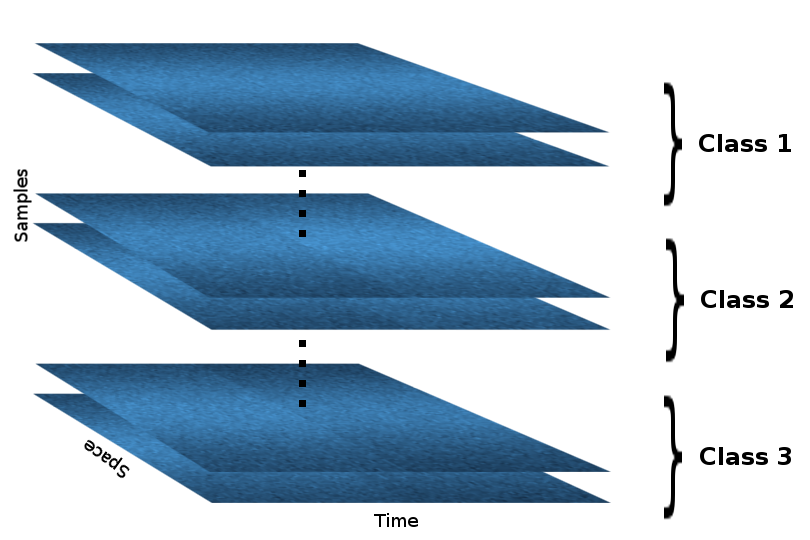
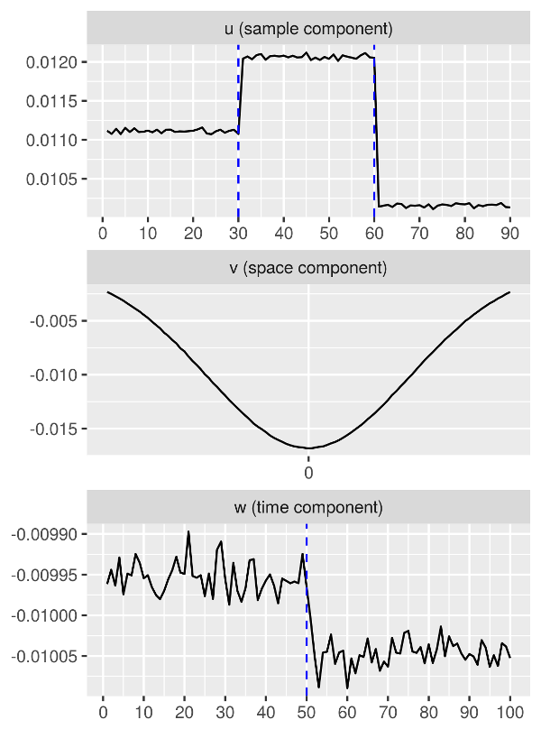
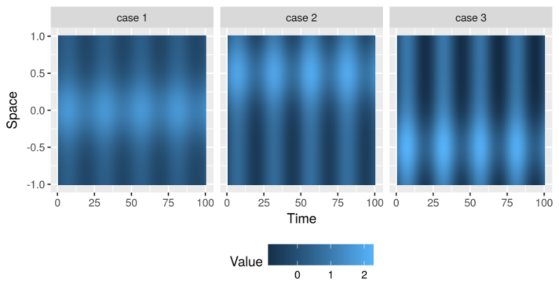
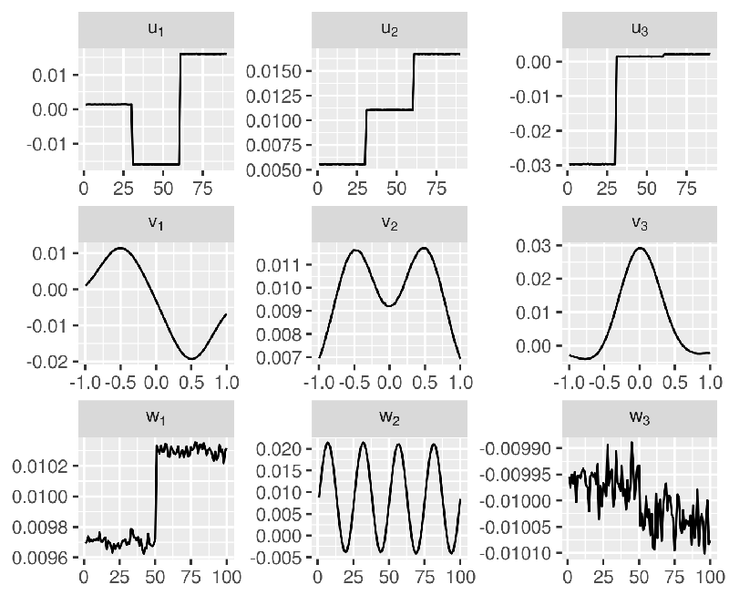

A tensor is essentially a multi-dimensional array:

- a tensor of order one is a vector, which simply is a column of numbers,
- a tensor of order two is a matrix, which is basically numbers arranged in a rectangle,
- a tensor of order three looks like numbers arranged in rectangular box (or a cube, if all modes have the same dimension),
- an *n*th order (or *n*-way) tensor looks like numbers arranged in... an $n$-hyperrectangle or something like that... you get the idea...

In many applications, data naturally form an *n*-way tensor with *n > 2*, rather than a "tidy" table.

So, what's a tensor decomposition?

Well, there are several types of tensor decomposition, but in this blog post I will introduce only the CANDECOMP/PARAFAC decomposition. Following [Kolda & Bader (2009)](http://epubs.siam.org/doi/abs/10.1137/07070111X?journalCode=siread&) I will refer to it as *CP decomposition*. But before spelling it out in mathematical terms, let's start with a simple toy example using the R language.

## Rank-1 approximation to a 3-way tensor (toy example)

Assume that we observe spatio-temporal[^1] data that, apart from random noise, correspond to the following three classes:



As you can see from the above figures, the essential difference between the three cases is that they behave differently with respect to time. The spatial component is just a Gaussian curve, while the temporal component is piecewise constant with a sudden jump at time 50, which differs in magnitude and in direction between the three classes.

Now assume we have collected samples that correspond to the three classes above (with some added noise). *But we don't know which sample falls in what class, how many classes there are, and how they differ* :confused:. In an unsupervised fashion we want to learn the different classes and their differences with respect to time and space.

We can arrange the samples in a 3-way tensor, *sample-by-space-by-time*. For simplicity, however, assume that the samples are already grouped according to their class within the tensor (but the algorithm doesn't know that!), so that the resulting tensor looks like this:



In R the above tensor (let's call it `X`) can be generated with the following lines of code:

```R
space_index <- seq(-1, 1, l = 100)
bell_curve  <- dnorm(space_index, mean = 0, sd = 0.5)
case1 <- matrix(rep(bell_curve, 10), 100, 100)
case2 <- matrix(rep(bell_curve, 10), 100, 100)
case3 <- matrix(rep(bell_curve, 10), 100, 100)
case2[ , 51:100] <- case2[ , 51:100] + 0.1
case3[ , 51:100] <- case3[ , 51:100] - 0.1

X <- array(NA, dim = c(90, 100, 100))
for(i in 1:30) {
  X[i, , ]    <- case1 + matrix(rnorm(10000, sd = 0.1), 100, 100)
  X[i+30, , ] <- case2 + matrix(rnorm(10000, sd = 0.1), 100, 100)
  X[i+60, , ] <- case3 + matrix(rnorm(10000, sd = 0.1), 100, 100)
}
```

Using the excellent R package [`rTensor`](https://cran.r-project.org/package=rTensor) we obtain the CP decomposition with one component per mode of the tensor:

```R
library(rTensor)
cp_decomp <- cp(as.tensor(X), num_components = 1)
str(cp_decomp$U)
# List of 3
#  $ : num [1:90, 1] 0.0111 0.0111 0.0111 0.0111 0.0112 ...
#  $ : num [1:100, 1] -0.00233 -0.00251 -0.00271 -0.00292 -0.00314 ...
#  $ : num [1:100, 1] -0.00996 -0.00994 -0.00996 -0.00993 -0.00997 ...
# NULL
```

Visualizing the three components, we get the following figures:



We can clearly see that
1. The sample-specific component has correctly separated the samples into three groups (in fact, `1:30` correspond to case 1, `31:60` correspond to case 2, `61:90` correspond to case 3).
2. The spatial component is bell-shaped, just as the input data with respect to the spatial dimension.
3. The temporal component has correctly picked up a change at time 50, which is where the three classes differ.

So, what did just happen? :astonished:

## CP decomposition (quick summary of the math behind it)

The CP decomposition factorizes a tensor into a sum of outer products of vectors. For example, for a 3-way tensor $X$, the CP decomposition can be written as

$$X \approx \sum\subscript{r = 1}^R u\subscript{r} \circ v\subscript{r} \circ w\subscript{r} =: \widehat{X},$$

where $R>0$ and $u\subscript{r}$, $v\subscript{r}$, $w\subscript{r}$ are vectors of appropriate dimensions, and where the notation "$\circ$" denotes the outer product for tensors, i.e.,

$$x\subscript{ijk} \approx \hat{x}\subscript{ijk} = \sum\subscript{r = 1}^R u\subscript{ri} v\subscript{rj} w\subscript{rk}.$$

In case of the previous toy example we have that $R = 1$. Thus, the corresponding CP decomposition has the following form:


I hope that explains, why the components `u`, `v`, and `w` in the toy example look the way they do! :bowtie:

Now, how do you solve for the components $u\subscript{r}$, $v\subscript{r}$, $w\subscript{r}$ ($r = 1, 2, \ldots, R$)? You need to solve the following optimization problem:

$$
\min\subscript{\widehat{X}} \lVert X - \widehat{X} \rVert \quad\mathrm{with}\, \widehat{X} = \sum\subscript{r = 1}^R \lambda\subscript{r} u\subscript{r} \circ v\subscript{r} \circ w\subscript{r},
$$

where $\lVert \cdot \rVert$ is the Frobenius norm.

The simplest way to do it is via an alternating least squares approach, where we would regard certain components as fixed while solving for others, and then iterate while alternating the components regarded as fixed... For much more rigour and detail see [Kolda & Bader (2009) *Tensor Decompositions and Applications*](http://epubs.siam.org/doi/abs/10.1137/07070111X?journalCode=siread&).

## A higher-rank approximation via CP (toy example cont.)

Since in the previous toy example, there are no differentiating features between the three classes, apart from a jump in the temporal component, it makes perfect sense to set $R = 1$ in CP. In order to try out CP with more than one component per mode, I generated data with a more complex structure, and with further differentiation between the three groups with respect to their temporal and spatial makeup:

1. The three classes still have a bell-shaped component in the spatial mode, but now each class has a different mean.
2. In the temporal mode the data is shaped like a sine wave, with different scaling per class.
3. As before, there is a sudden jump in the temporal mode at time 50.

The three classes in the resulting dataset have the following means.



As before, we generate a tensor `X` of dimensions 90 &times; 100 &times; 100, with 30 samples per class obscured with random noise.

<!---
```R
# bell-shaped spatial component with different means
space_index <- seq(-1, 1, l = 100)
case1 <- matrix(rep(dnorm(space_index, mean = 0, sd = 0.3), 10), 100, 100)
case2 <- matrix(rep(dnorm(space_index, mean = 0.5, sd = 0.3), 10), 100, 100)
case3 <- matrix(rep(dnorm(space_index, mean = -0.5, sd = 0.3), 10), 100, 100)
# sine-shaped temporal component
sine_wave <- sin(seq(-4*pi, 4*pi, l = 100))
sine_mat  <- matrix(rep(sine_wave, each = 100), 100, 100)
case1 <- case1 + 0.3 * sine_mat
case2 <- case2 + 0.6 * sine_mat
case3 <- case3 + 0.9 * sine_mat
# suddent drops in the temporal component
case2[ , 51:100] <- case2[ , 51:100] + 0.1
case3[ , 51:100] <- case3[ , 51:100] - 0.1

X <- array(NA, dim = c(90, 100, 100))
for(i in 1:30) {
  X[i, , ] <- case1 + matrix(rnorm(10000, sd = 0.1), 100, 100)
  X[i+30, , ] <- case2 + matrix(rnorm(10000, sd = 0.1), 100, 100)
  X[i+60, , ] <- case3 + matrix(rnorm(10000, sd = 0.1), 100, 100)
}
```
--->

We use a CP decomposition in order to obtain a rank-3 approximation to that tensor:

```R
cp_decomp <- cp(as.tensor(X), num_components = 3, max_iter = 100)
```

Here, we increase `max_iter` to 100, in order to ensure convergence, as can be checked with the `conv` attribute:

```R
cp_decomp$conv
# [1] TRUE
```

Since we set `num_components = 3`, the solution now has three components per mode, organized in a three-column matrix for each mode:

```R
str(cp_decomp$U)
# List of 3
#  $ : num [1:90, 1:3] 0.00131 0.00137 0.00141 0.0014 0.00135 ...
#  $ : num [1:100, 1:3] 0.000926 0.001345 0.001799 0.002228 0.002755 ...
#  $ : num [1:100, 1:3] 0.00969 0.0097 0.00974 0.0097 0.00971 ...
# NULL
```

And we can even check the percentage of the Frobenius norm of $X$ explained by the rank-3 approximation $\widehat{X}$:

```R
cp_decomp$norm_percent
# [1] 83.13865
```

83% isn't too bad!

:grinning: Let's look at a visualization of the obtained components!



Indeed, we observe that,

- the sample-specific components $u\subscript{r}$ clearly distinguish between the three groups of samples (`1:30`, `31:60`, and `61:90`),
- the spatial components $v\subscript{r}$ clearly picks up the Gaussian shapes with the three different means (at -0.5, 0, and 0.5),
- the temporal components $w\subscript{r}$ clearly show the sudden jump at time 50, as well as a sine wave.

That's it for now. In the next couple of weeks I am planning to write a couple blog posts on other types of tensor decompositions and tensor regression methods, as I am learning about them.

--------------------------------------

[^1]: The two data modes can correspond to many types of measurements, other than space and time. Here, I use space and time for example purposes only because those are very familiar concepts. I am neither suggesting that specifically spatio-temporal data should be analyzed in this way, nor that tensor decomposition is generally a good approach for spatio-temporal data (I actually have no idea).
