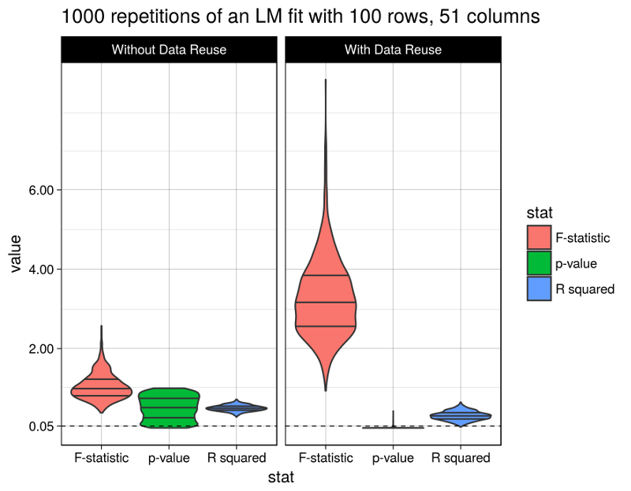

Recently I came across the classical 1983 paper [*A note on screening regression equations*](http://www.public.asu.edu/~gasweete/crj604/readings/1983-Freedman%20(Screening%20Regression%20Equations).pdf) by [David Freedman](https://en.wikipedia.org/wiki/David_A._Freedman). Freedman shows in an impressive way the dangers of data reuse in statistical analyses. The potentially dangerous scenarios include those where the results of one statistical procedure performed on the data are fed into another procedure performed on the same data. As a concrete example Freedman considers the practice of performing variable selection first, and then fitting another model using only the identified variables on the same data that was used to identify them in the first place. Because of the unexpectedly high severity of the problem this phenomenon became known as ["Freedman's paradox"](https://en.wikipedia.org/wiki/Freedman%27s_paradox). Moreover, in his paper Freedman derives asymptotic estimates for the resulting errors.

The 1983 paper presents a simulation with only 10 repetitions. But in the present day it is very easy (both in terms of computational time and implementation difficulty) to reproduce the simulation with many more repetitions (even my phone's computational power is probably higher than that of the high performance computer that Freedman used in the 80's). We also have more convenient ways to visualize the results than in the 80's. So let's do it.

I am going to use a few R packages (most notably the package `broom` to fit and analyze many many linear models in a single step).


```r
library(dplyr)
library(broom)
library(ggplot2)
library(tidyr)
set.seed(20170605)
```

The considered data structure is the following:

* A matrix of predictors with 100 rows and 50 columns is generated with independent standard normal entries.
* The response variable is generated independently of the model matrix (also from the standard normal distribution), i.e., the true answer is that there is no relationship between predictors and response.

Instead of Freedman's 10 repetitions we perform 1000. So let's generate all 1000 datasets at once as stacked in a large data frame:


```r
n_row <- 100
# n_col is set to 51 because the 51st column will serve as y
n_col <- 51
n_rep <- 1000

# a stack of matrices for all n_rep repetitions is generated...
X <- matrix(rnorm(n_rep * n_row * n_col), n_rep * n_row, n_col)
colnames(X) <- paste0("X", 1:n_col)
# ...and then transformed to a data frame with a repetition number column
X_df <- as_data_frame(X) %>% mutate(repetition = rep(1:n_rep, each = n_row))
```

**The data are analyzed in two successive linear models. The second (illegally) reusing the results of the first.**

*The first model fit.*
After the 1000 ordinary linear models are fit to the data, we record for each of them the R squared, the F test statistic with corresponding p-value, and the t test statistics with p-values for the individual regression coefficients.

Using functions from the `broom` package we can fit and extract information from all 1000 models at once.


```r
# all models can be fit at once...
models_df = X_df %>% group_by(repetition) %>%
  do(full_model = lm(X51 ~ . + 0, data = select(., -repetition)))
# ...then the results are extracted
model_coefs <- tidy(models_df, full_model)
model_statistics <- glance(models_df, full_model)
model_statistics$data_reuse <- rep(FALSE, nrow(model_statistics))
```

*The second model fit.*
For each one of the first 1000 models, the corresponding second linear model is fit using only those variables which have p-values significant at the 25% level in the first model.
That is, the second model uses the first model for variable selection.

This gives us 1000 reduced re-fitted linear models. We record the same model statistics (R squared, F, and t tests) as for the first group of models.


```r
reduced_models <- list()
for (i in 1:n_rep) {
  full_data <- X_df %>% filter(repetition == i)
  significant_coefs <- model_coefs %>%
    filter(repetition == i & p.value < 0.25)
  reduced_data <- select(full_data,
                         one_of(unlist(significant_coefs[ , "term"])), X51)
  reduced_models[[i]] <- lm(X51 ~ . + 0, data = reduced_data)
  tmp_df <- glance(reduced_models[[i]])
  tmp_df$repetition <- i
  tmp_df$data_reuse <- TRUE
  model_statistics <- bind_rows(model_statistics, tmp_df)
}
```

Finally let's look at the results. The figure shows the distributions of the considered model statistics across the 1000 repetitions for model fits with and without data reuse (the code producing this figure is given at the bottom of this post):



Well, the R squared statistic shows a moderate change between models with or without data reuse (average of 0.3093018 vs. 0.5001641). The F test statistic however grows immensely to an average of 3.2806118 (from 1.0480097), and the p-values fall after data reuse to an average of 0.0112216 (from 0.5017696), below the widely used (but arbitrary) 5% significance level.

Obviously the model with data reuse is highly misleading here, because in fact there are absolutely no relationships between the predictor variables and the response (as per the data generation procedure).

In fact, Freedman derived asymptotic estimates for the magnitudes of change in the considered model statistics, and they indeed match the above observations. However I'm too lazy to summarize them here. So I refer to [the primary source](http://www.public.asu.edu/~gasweete/crj604/readings/1983-Freedman%20(Screening%20Regression%20Equations).pdf).


-----------
This code generates the above figure:

```r
model_statistics %>%
  select(r.squared, p.value, statistic, repetition, data_reuse) %>%
  mutate(data_reuse = ifelse(data_reuse, "With Data Reuse", "Without Data Reuse")) %>%
  mutate(data_reuse = factor(data_reuse, levels = c("Without Data Reuse", "With Data Reuse"),
                             ordered = TRUE)) %>%
  rename("F-statistic" = statistic, "p-value" = p.value, "R squared" = r.squared) %>%
  gather(stat, value, -repetition, -data_reuse) %>%
  ggplot(aes(x = stat, y = value)) +
    geom_violin(aes(fill = stat), scale = "width", draw_quantiles = c(0.25, 0.5, 0.75)) +
    geom_hline(yintercept = 0.05, linetype = 2, size = 0.3) +
    facet_wrap(~data_reuse) +
    theme_linedraw() +
    scale_y_continuous(breaks = c(0.05, 2, 4, 6)) +
    ggtitle(paste(n_rep, "repetitions of an LM fit with", n_row, "rows,", n_col, "columns"))
```
